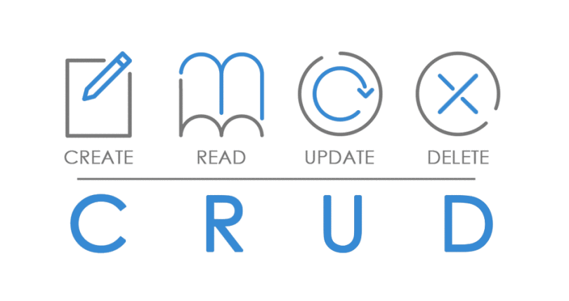

# CRUD
## Create - Read - Update - Delete

En programación, crear, leer, actualizar y borrar ( con el acrónimo CRUD) son las cuatro funciones básicas de la persistencia de Bases de Datos. Términos alternativos son usados a veces cuando se definen las cuatro funciones básicas de CRUD, como “recuperar” en vez de “leer”, “modificar” en vez de “actualizar” o “destruir” en vez de “borrar”. CRUD se usa también a veces para describir convenciones de interfaz de usuario que facilita la vista, búsqueda y modificación de la información; a menudo se usa en programación de formularios (forms) e informes (reports). El acrónimo puede extenderse a CRUDL para cubrir el listado de gran cantidad de datos que conllevan una complejidad tal como paginación cuando los registros de datos son demasiado grandes para alojarse fácilmente en memoria.

